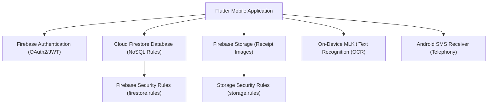

# Backend Discovery & Technology Stack Inventory

**Application:** SmartFund Management (Expense Tracker App)  
**Repository:** `https://github.com/sureshdeepika876/smartfundmanagement_app`  
**Assessment Date:** August 2026  
**Auditor:** Senior Application Security & Quality Architect  

---

## 1. Executive Summary

This inventory captures the complete backend architecture, runtime environments, external services, data management layers, and API endpoint surface for the SmartFund Management system.

---

## 2. Technology Stack Overview

| Category | Component / Library | Details & Version |
| :--- | :--- | :--- |
| **Language** | Dart / Java | Dart SDK `^3.0.0` / Java 11+ |
| **Client Framework** | Flutter | Material 3 Design |
| **Authentication** | Firebase Auth | `firebase_auth: ^6.5.6` |
| **Database / Storage** | Cloud Firestore / Firebase Storage | `cloud_firestore: ^6.7.1`, `firebase_storage: ^13.4.5` |
| **OCR Processing** | On-Device MLKit | `google_mlkit_text_recognition: ^0.16.0` |
| **State Management** | Provider | `provider: ^6.1.2` |
| **Notifications** | FCM & Local Notifications | `firebase_messaging: ^16.4.3`, `flutter_local_notifications: ^22.2.0` |
| **Export Formats** | PDF & Excel | `pdf: ^3.11.0`, `excel: ^4.0.2` |

---

## 3. Architecture & Data Flow

---

## 4. API & Endpoint Surface Summary

- **Authentication Endpoints:** Firebase Auth REST API (`identitytoolkit.googleapis.com/v1/accounts`)
- **Firestore Collections:**
  - `users/{userId}` - User profile metadata
  - `expenses/{expenseId}` - Expense & income transactions
  - `budgets/{budgetId}` - Category monthly budgets
  - `goals/{goalId}` - Savings goals
  - `groups/{groupId}` - Group split transactions
- **Security Rules:** Configured in `firestore.rules` & `storage.rules`

---

## 5. Security & Risk Assessment Notes

1. **Authentication:** Uses standard JWT tokens issued by Google Firebase.
2. **Authorization:** Relies on Firestore Security Rules matching `request.auth.uid == resource.data.userId`.
3. **Receipt Processing:** Performed client-side via Google MLKit (no server-side data leakage).
4. **SMS Reading:** Restricted strictly to Android devices for automated bank transaction parsing.
